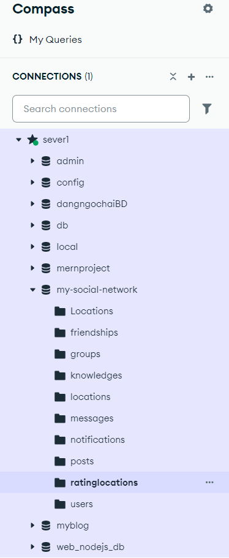

# Hướng Dẫn Chạy Website Du Lịch

Dự án bao gồm 3 phần chính:

- **Frontend** (React)
- **Backend** (Node.js/Express)
- **Hệ thống gợi ý** (Flask + MongoDB + Machine Learning)

---

## 🖥️ Frontend (React)

### Bước 1: Di chuyển vào thư mục `frontend`

cd frontend

### Bước 2: Cài đặt thư viện

npm install

### Bước 3: Chạy ứng dụng

npm run dev
Ứng dụng sẽ chạy tại địa chỉ: http://localhost:5173

## Backend (Node.js + Express)

### Bước 1: Di chuyển vào thư mục backend

cd backend

### Bước 2: Cài đặt thư viện

npm install
Chuẩn bị MongoDB tạo database name my-social-network

### Bước 3: Chạy server

npm run dev
Server backend mặc định chạy tại: http://localhost:5000 (tùy theo cấu hình)

## 🤖 Hệ Thống Gợi Ý (Flask + MongoDB)

### Bước 1: Di chuyển vào thư mục hệ thống gợi ý

cd hethonggoiy/VietNam-Travel-Recommendation-System

### Bước 2: Cài đặt thư viện Python

pip install flask pymongo scikit-learn flask-cors

### Bước 3: Chạy ứng dụng Flask

python app3.py

# Flask app sẽ chạy tại: http://localhost:5001 (tùy theo cài đặt trong app3.py)

⚠️ Yêu Cầu Hệ Thống
Node.js >= 16.x

Python >= 3.8

MongoDB đang chạy local hoặc trên cloud (ví dụ MongoDB Atlas)

Các port mặc định chưa bị ứng dụng khác chiếm dụng
